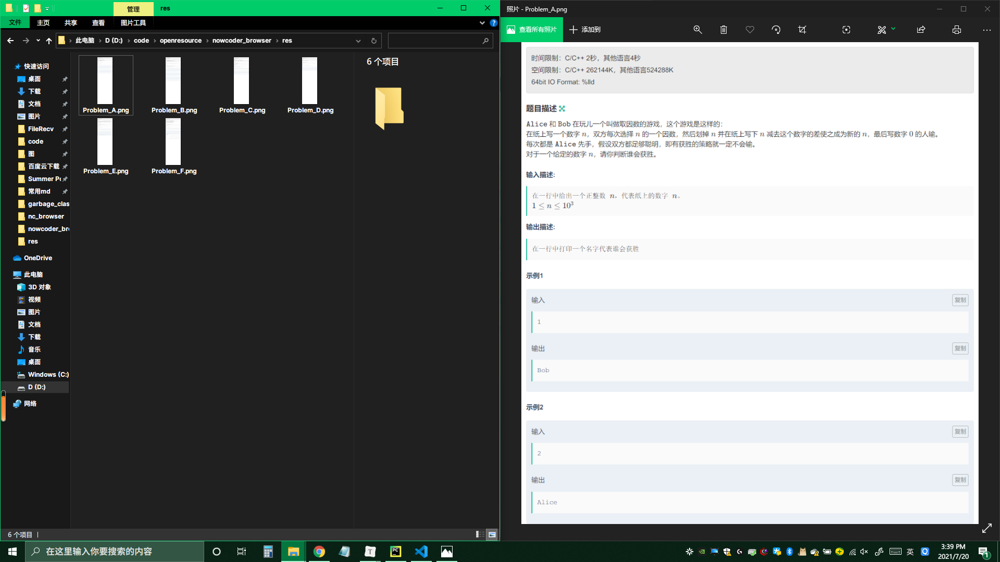

# nowcoder_browser
牛客竞赛题面批量截图工具

本来是想写来方便队友读题的，因为牛客不支持全部看题也不支持导出题面PDF，但后来发现没什么用~~（毕竟能团队报名）~~。

## 依赖
+ Python 3.7：别太老就行
+ [Selenium](https://www.selenium.dev/)：一个Python的Webdriver库。使用`pip install selenium`安装。如果你的Python包管理使用的是conda那么应该已经自带了。
+ Google Chrome 91.0.4472.164 ：别太老就行
+ [Chrome Driver][https://sites.google.com/chromium.org/driver/] ：版本要与Chrome一致

## 使用方法（on Windows）

1. 使用git clone将本项目拉到本地：`git clone git@github.com:tml104/nowcoder_browser.git`。
2. 下载Chrome Driver，然后将其解压到一个目录下，然后取得chromedriver.exe的绝对路径（例如：`D:\chromedriver_win32\chromedriver.exe`）。注意路径中不能有中文字符。
3. 打开settings.cfg。将Chromedrive_path右侧的值改成第2步中的路径。
4. 修改settings.cfg：
   1. Contest_id ：比赛的id号。也就是比赛主界面的url中的最后5位数字（目前是5位数字）
   2. Min_problem_char ：开始截图的题目对应字母。
   3. Max_problem_char ： 结束截图的题目对应字母。
   4. Width 、Height：浏览器的视口大小。这会影响到截图的宽度和高度。默认是1920*3000. 尽量只修改Height。如果存在题目太长的情况或者截图不清晰，请尝试增加/减少Height的数值。
   5. Out_path：截图的输出路径，默认输出到./res下。

5. 在当前目录下新建Cookie.txt。
6. 获取Cookie。之所以要做这一步是因为某些比赛必须要报名了才能查看，因此需要登录帐号：
   1. 在浏览器上登录牛客帐号。
   2. 打开任意一个比赛主界面，然后打开开发者工具（F12）
   3. 切换到Network选项卡，确保左边有个红色圆点亮着，然后刷新当前比赛页面（F5）。
   4. 找到一个和当前比赛id相同的包。点一下，然后在右边的Headers中找到cookie，右键点击copy value。
      
   5. 粘贴到Cookie.txt中。
7. 在当前目录下运行nowcoder_browser.py。：`python nowcoder_browser.py`

现在应该能在res文件夹中看到截图结果了。效果如图（当然截出来的图得放大了看）：

